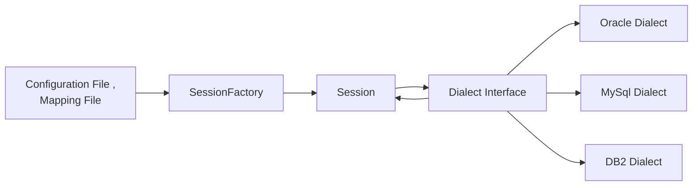
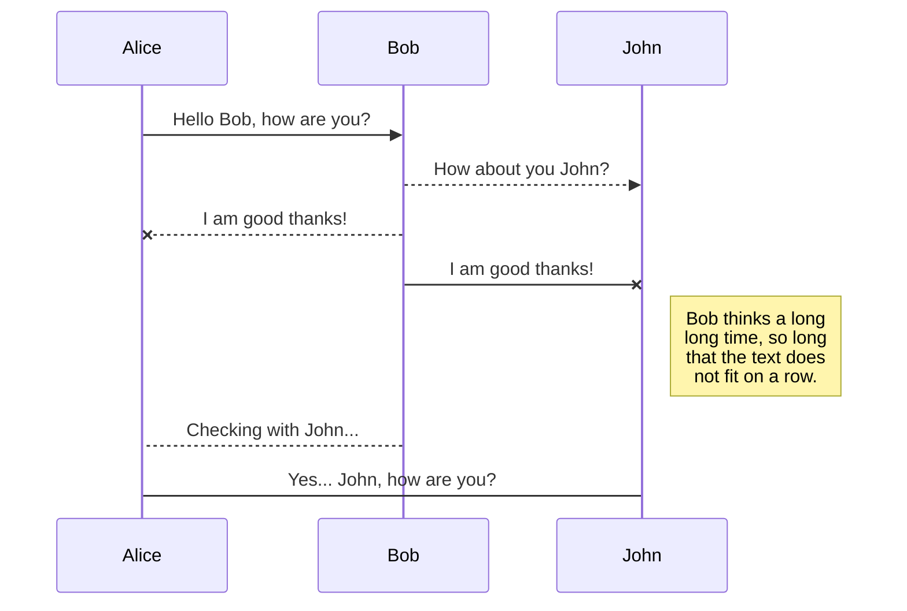

# Welcome to StackEdit!

##Hibernate V/s JDBC:

 1. One of the new problem with JDBC is JDBC Exceptions are checked exceptions.
2. JDBC suffering from more problems to persist the data. If we want to perform any operation we have to know about the whole details about the particular table. About table name, datatypes, column name, whole schema about the table etc.We’ll get data in relational format only.
3. Most of the time we want data in the object format but JDBC will give data in Relational format, as programmer we have to write for conversation logic object or relational format and relational format to Object format.
4. JDBC hard to perform transaction Management
5. Local Transaction is performed by JDBC but global transaction is performed by JTA. So we cannot handle both with JDBC.
6. JPA we can use JPQL Queries which is independent from DB queries
7. Boiler plate logic for Keygenerator and timesatmp in jDBC.
8. Hibernate Mapped the object directly with Object , but in jDBC we have to write the resultset.

## Hibernate CLass:

### Session: 
Object which contain mapping and configuration information and used to have the connection from Database. We cannot create the session object by own because for every transaction we need session object mean every time we will create a new connection. So to get session object we can use sessionFactory

### SessionFactory:
To give the session object we pass the datasource and configuration information and get the session object.
[Configuration.java](./src/main/java/com/example/springjpa/config/Configuration.java)

###  Dialect
It is used to convert HQL to underlying BD queries and vice versa. It also contain all the syntax and structure of DB queries. And also it contain the datatype. So in dialect we have one datatype which later on convert to underline database datatype.

## Lazy Fetch and Eager Fetch
When we mapped the object there may be another object which need to mapped. For example for Book class we also have Person Object which need to get Value. So in lazy fetch when we call the IssueCard class it will create a proxy object of person and instead of going to db to get value it will populate default value. But when we access the person object i.e. issueCaed.getPerson() then it will again go to db and fetch the value . So this is called lazy Fetch .
But in Eager fetch it will prepolute the value.

[Example of lazy fetch ](./src/main/java/com/example/springjpa/model/IssueCard.java)

### EntityManager 
flush(): To write the data to object at this point
detach(Object): No longer to track the change for the object
clear(): No longer to track the change in entity manager for all object.
refresh(object): Whatever the change done to object is not required rollback it.
[Example](./src/main/java/com/example/springjpa/dao/PersonRep.java)

# Transaction Management

ACID Properties

### A: Atomicity:
In the operation all the transaction made be operation should be completely rollback or should be completely successful. There should not be any partial transaction.

### C: Concurrent:
If there are n transaction happening in parallel and it should give same result to each transacrtion.

### I: Isolation:
How the transaction should affect the other transaction. Ex if transaction A happen and transaction B also happen so transaction B should see the affected value of transaction A or not. There are 4 level of isolation.

### D: Durability:
If transaction happen successfull and the server restart then also transaction value should be there. 

## Isolation Level:

### Transaction Isolation level is determined by following schema:
### Dirty Read:
A Dirty read is the situation when a transaction reads a data that has not yet been committed.
Example: Tansaction 1 update the value . And it didnt commit while transaction 2 read the updated value . At later of time transaction1 rollback , so transaction2 has the value which is never existed.

### Non Repetable Read:
Non Repeatable read occurs when a transaction reads same row twice, and get a different value each time
For Example: Transation 1 Read the row with attribute
Transaction 2 update the data
Transation 1 read the same rowdata.
So transation 1 read the same row with different attribute value..

### Phantom Read:
Phantom Read occurs when two same queries are executed, but the rows retrieved by the two, are different.
For example:
Transaction 1 read the data and get 1 row. with age=10
Transaction 2 insert one more row with age=10
Transaction 1 again read the data with 2 raow with age=10

### Isolation Level:
|Level|Dirty Read	| Non Repeatable Read |PhantomRead 
|--|--|--|--
| Read Uncommited | Allow |Allow|Allow
| Read Commited| Not Allowed|Allow|Allow
| Repeatale Read|Not Allowed |Not Allowed|Allow
| Serializable | Not Allowed|Not Allowed|Not Allowed

### Read Uncommited:
Read Uncommitted is the lowest isolation level. In this level, one transaction may read the uncommited change made by another transaction. So transaction are not isolated by each other. Here Dirty Read, non Repetable Read, Phantom Read are allowed.

### Read Commited
We allow transaction to read only the commited data. Uncommited data is not read. Using this we can only solve Dirty Read.

### Repeatable Read:
The transaction wait until the write lock is unlocked by other transaction which is writing, updating, modifying the data.
So in this we are save from Repetable read. 
And the transaction read only commited data, so we are save with dirty read.

### Serializable:
The transaction wait until the write lock is unlocked by other transaction which is writing, updating, modifying the data.
So in this we are save from Repetable read. 
And the transaction read only commited data, so we are save with dirty read.
When on transaction is doing the read , it will put the read lock so that other transaction cannot insert the row, so this way we can save from phantom read.
This is the highest isolation level.

> When we go from highest isolation level the performance decreases and performance goes on increasing as we reach to lowest isolation level.

###  Propogation
Spring use the propogation to configure the transaction boundary across business layer,

 1.    **REQUIRED** — support a current transaction, create a new one if none exist
2.  **REQUIRES_NEW** — create a new transaction and suspend the current transaction if none exist
3.   **MANDATORY** — support a current transaction, throw an exception if none exists
4   **NESTED** — executes within a nested transaction if a current transaction exists
5   **SUPPORTS** — supports currents transaction but execute non-transactionally if none exists

### Implementation of transaction management:
@transactional from javax.transaction.Transactional is good to manage transation for single db.

But in an operation when we have 2 DB and we have to manage transaction it good to use @Transactional of org.springframework.transaction.annotation.Transactional.

Attribute in @Transactional spring :
-   **readOnly —**  whether the transaction is read-only or read/write
-   **timeout —**  transaction timeout
-   **rollbackFor —**  arrays of exception class objects that must cause a rollback of the transaction
-   **rollbackForClassName —** arrays of exception class names that must cause a rollback of the transaction
-   **noRollbackFor —** arrays of exception class objects that must not cause a rollback of the transaction
-   **noRollbackForClassName —**  arrays of exception class names that must not cause a rollback of the transaction
**- Propogation**
**Isolation**

[Example](./src/main/java/com/example/springjpa/config/Configuration.java)

And this will produce a flow chart:

